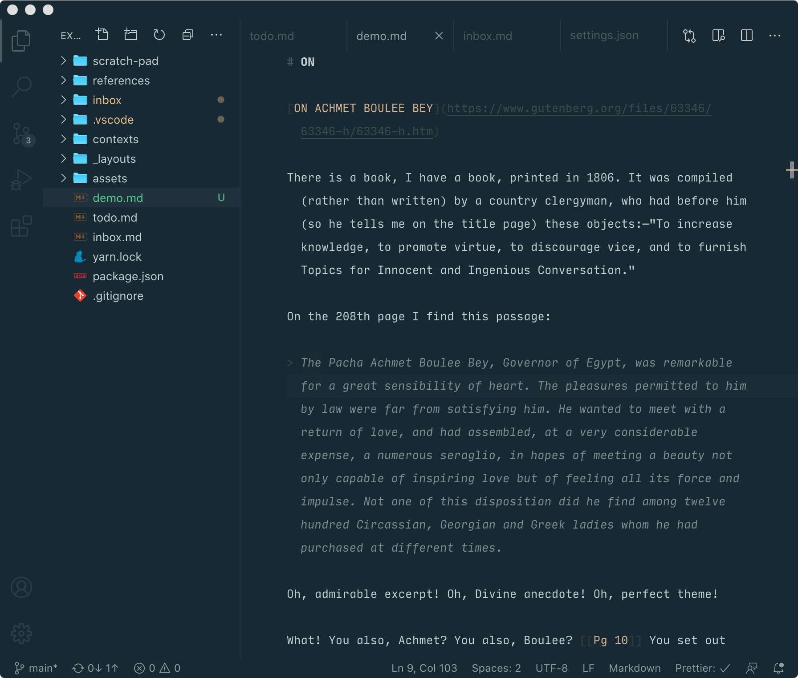
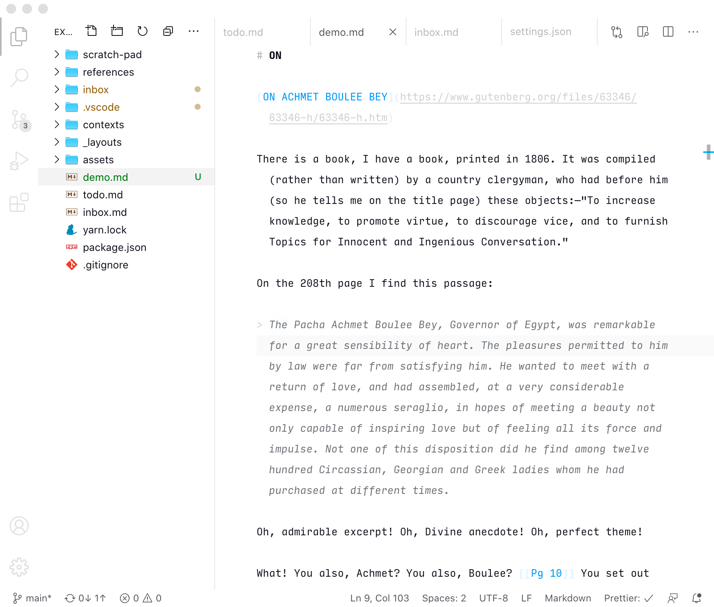
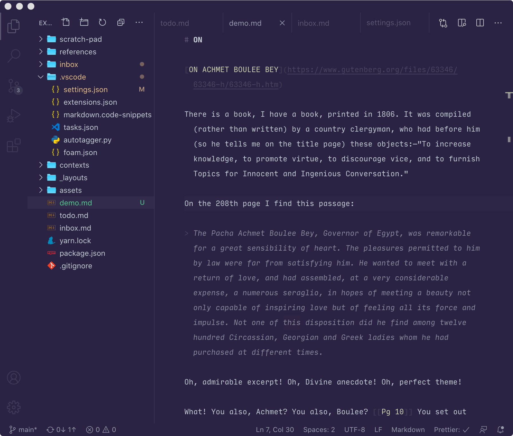
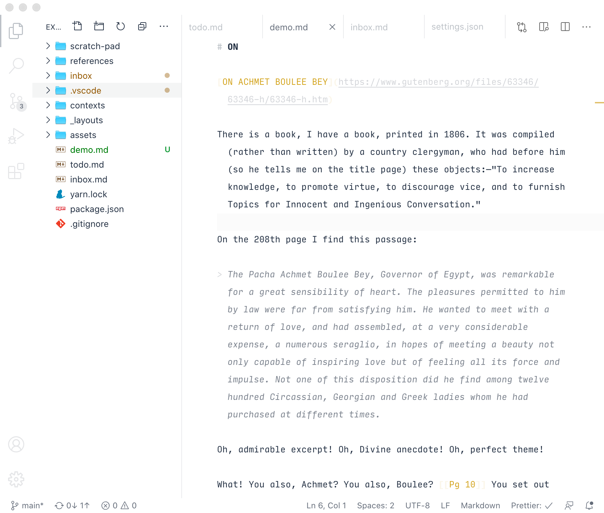

# Markdown Writer

Minimalist themes for writing markdown. There are two variants: `light` and `dark`. Each variant is controlled by three customizable color setting: `foregroundColor`, `backgroundColor`, and `accentColor`.

Default Dark



---

Default Light



---

Custom Dark

```
"markdown-writer-theme.dark.accentColor": "#d3d8b6",
"markdown-writer-theme.dark.backgroundColor": "#292442",
"markdown-writer-theme.dark.foregroundColor": "#c5cdd3",
```



---

Custom Light

```
"markdown-writer-theme.light.accentColor": "#cca43b",
"markdown-writer-theme.light.backgroundColor": "#ffffff",
"markdown-writer-theme.light.foregroundColor": "#242f40",
```

